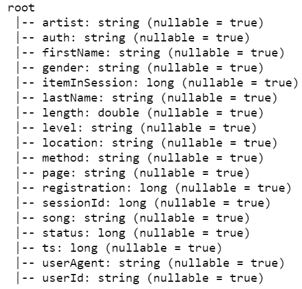
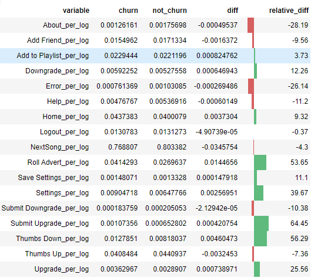
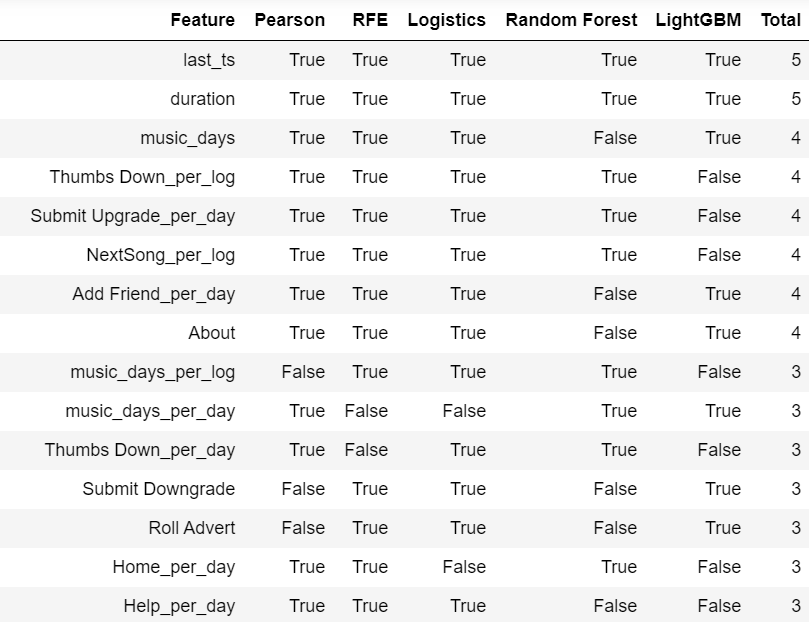

# Sparkify Churn Prediction

### Table of Contents

1. [Installation and Instructions](#installation)
2. [Project Motivation](#motivation)
3. [File Descriptions](#files)
4. [Results](#results)
5. [Licensing](#licensing)

## Installation and Instructions

You will need the standard data science libraries found in the Anaconda distribution of Python. Especially, the following packages are required:

- NumPy
- Pandas
- Matplotlib

Additionally, PySpark needs to be installed what can be done with `pip install pyspark`.
  
In order to run the notebooks on the mini subset of the data, you need to unzip the files from `data/sparkify-event-data.zip` into the same folder. By default the notebooks will run on `mini_sparkify_event_data.json`. Feel free to adapt the loading parts and make use of the `medium-sparkify-event-data.json` that was used to build and evaluate the model on the cluster.

## Project Motivation

This project is the capstone project of Udacity's Data Scientiest Nanodegree. The goal of this project is to apply efficient data manipulations on large data and gather experience with Sparks Machine Learning API to build and tune models. For this Udacity provided data from a virtual company called Sparkify which is used to predict churn and run all development steps on a cluster (e.g. from IBM Watson or AWS).
  
Predicting churn rates is an important problem for companies which business model is based on subscriptions. If the company figures out why and which customers might churn, they can conduct counter measures to try to keep the customer with their company.

## File Descriptions 

The most important files in this repository:

* `Sparkify_data_analysis.ipynb` - This jupyter notebook contains the loading and first analysis of the mini subset of the data. The data is inspected and differences between churned and not churned users illustrated.

* `Sparkify_feature_importance.py` - This jupyter notebook contains the feature engineering and feature selection. This is the basis for building the model.

* `Sparkify_model.py` - This jupyter notebook contains building machine learning models for churn prediction and the final evaluations.

* `data/feature_df.csv` - Csv-file with the data that was used as input for the feature selection.

* `data/feature_selection_df.csv` - Csv-file with the result of the feature importance (voting) that is read in during the model building.

* `data/sparkify-event-data.zip` - Zip-file containing the mini and medium sparkify event data as jsons which are used in this project.

* `images/*` - Visualizations

## Results

The main findings of the code can be found at the ...

### Data Analysis

Schema of the log entries for Sparkify:

Section from the differences between the users who churn and who did not:

### Feature Engineering and Feature Selection

Five different algorithms for feature selection are implemented and combined in a way that each algorithm votes for the importance of a feature. Only the features with a minimum voting are considered for further modeling.
  

### Modeling and Evaluation

The following machine learning models are implemented for customer churn prediction:
  
- Random Forest Classifier
- Logistic Regression
- Gradient-boosted Tree Classifier (GBTC)
  
All steps of the modeling are put in a machine learning pipeline that chains different transformers and the predictors one after each other. Numerical variables are scaled and dummy variables are created for categorical variables.
  
The parameters for each model are tuned with grid search and cross validation. The performance of the models is evaluated with the F1-Score because of the imbalanced dataset.
  
From all the models the random forest classifier achieves the best performance. The scores on the training and test set are shown below:

todo: screenshot results

### Screenshots

## Licensing, Authors and Acknowledgements

Must give credit to Udacity for setting up this capstone project and providing the data. But also Rahul Agarwal for the reference for the implemented [feature selection algorithms](https://towardsdatascience.com/the-5-feature-selection-algorithms-every-data-scientist-need-to-know-3a6b566efd2).